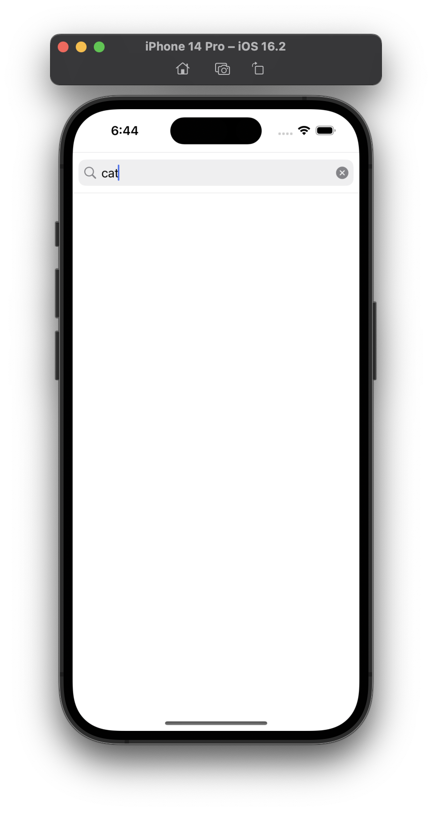
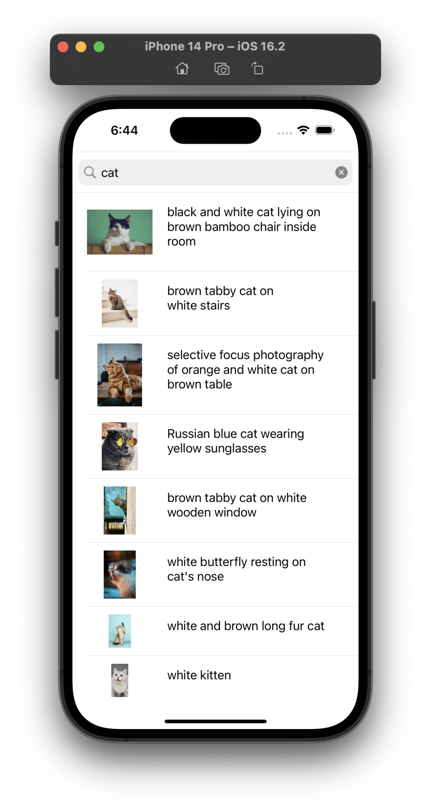

# ios_Unsplash_searchPhoto_app
---
## 프로젝트 목적
* Alamofire를 학습하기 위한 프로젝트입니다.  
원하는 사진를 검색하여 이미지와 간단한 설명을 확인할 수 있습니다.
---
## 프로젝트 설명
* 사용기술


  
  
* 개발환경


   
 
* 기능설명  


  * 검색창에 사진을 검색할 수 있습니다.
  * 사진과 사진에 대한 간단한 설명을 확인할 수 있습니다.
  
    

 * 프로젝트 구조  

<table>
<tbody>

<tr>
    <td><b>ViewController.swift</b></td>
<td> searchBar에 관련한 내용, 테이블 뷰 구성과 Alamofire를 이용하여 데이터를 받아오는 부분으로 이루어져 있습니다.</td>
</tr>

<tr>
    <td><b>UnsplashModel.swift</b></td>
<td>JSON코드를 DTO한 파일입니다.</td>
</tr>

<tr>
    <td><b>unCell.swift</b></td>
<td>cell을 구성하기 위한 컴포넌트 아울렛이 연결되어 있는 부분입니다.</td>
</tr>

<tr>
    <td><b>Main.Storyboard</b></td>
<td> 검색 목록 화면을 구성하는 storyboard 파일입니다.</td>
</tr>


</tbody>
</table>

* 실행방법  
```
1. Clone this repository.
2. Run Xcode and excute project.
```
